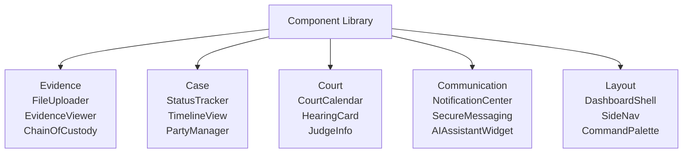

# Justice Tech Component Library

**Reusable building blocks for the ecosystem.**

## The Problem

Every justice tech organization rebuilds the same components from scratch -- file uploaders, case trackers, calendars, notification systems -- wasting precious time and funding. The result is fragmented, inconsistent tools that don't interoperate and can't be maintained long-term.

## The Solution

An open-source, accessible, well-tested component library purpose-built for justice applications. This directly answers the call to "create shared, open-source component libraries" for the justice tech ecosystem. Instead of every organization reinventing the wheel, teams can build on a common foundation and focus their energy on what makes their tool unique.



## Who This Helps

- **Justice tech developers** who want production-ready, accessible components out of the box
- **Legal aid organizations** building tools on tight budgets and timelines
- **Court IT departments** modernizing legacy systems with consistent UI patterns
- **Civic tech volunteers** contributing to justice projects without starting from zero

## Features

- **20+ production-ready components** spanning evidence, case, court, communication, and layout
- **WCAG 2.1 AA accessible** -- every component meets accessibility standards
- **Storybook documentation** -- interactive examples and usage guides for every component
- **TypeScript-first** -- full type safety and IntelliSense support
- **Tailwind CSS styling** -- customizable design tokens that adapt to any brand
- **Tree-shakeable ESM exports** -- import only what you need, keep bundles small

## Quick Start

```bash
npm install @justice-os/components
```

```tsx
import { FileUploader, StatusTracker, DashboardShell } from '@justice-os/components';

// Build a case dashboard in minutes
function CaseDashboard() {
  return (
    <DashboardShell title="My Case" sidebar={<nav>...</nav>}>
      <StatusTracker
        status={{ id: '1', label: 'Discovery', stage: 'discovery', updatedAt: new Date() }}
        stages={['Filed', 'Served', 'Discovery', 'Mediation', 'Hearing', 'Resolved']}
      />
      <FileUploader
        acceptedTypes={['pdf', 'jpg', 'png']}
        maxSizeMB={25}
        onUpload={(files) => console.log('Uploaded:', files)}
        label="Upload evidence files"
      />
    </DashboardShell>
  );
}
```

See [`examples/dashboard-demo.tsx`](./examples/dashboard-demo.tsx) for a complete working dashboard.

### Development

```bash
git clone https://github.com/dougdevitre/justice-components.git
cd justice-components
npm install
npm run dev  # Opens Storybook at localhost:6006
```

## Roadmap

| Feature | Status |
|---------|--------|
| Evidence components (FileUploader, EvidenceViewer, ChainOfCustody) | Done |
| Case components (StatusTracker, TimelineView, PartyManager) | In Progress |
| Court components (CourtCalendar, HearingCard, JudgeInfo) | In Progress |
| Communication components (NotificationCenter, SecureMessaging) | Planned |
| Layout components (DashboardShell, SideNav, CommandPalette) | Done |
| Storybook documentation for all components | Planned |

## Architecture

See [`docs/architecture.md`](./docs/architecture.md) for detailed Mermaid diagrams covering the component taxonomy, design system architecture, and theme provider.

## Contributing

See [CONTRIBUTING.md](./CONTRIBUTING.md) for guidelines.

## License

MIT -- see [LICENSE](./LICENSE) for details.

---

## Justice OS Ecosystem

This repository is part of the **Justice OS** open-source ecosystem — 22 interconnected projects building the infrastructure for accessible justice technology.

### Core System Layer
| Repository | Description |
|-----------|-------------|
| [justice-os](https://github.com/dougdevitre/justice-os) | Core modular platform — the foundation |
| [justice-api-gateway](https://github.com/dougdevitre/justice-api-gateway) | Interoperability layer for courts |
| [legal-identity-layer](https://github.com/dougdevitre/legal-identity-layer) | Universal legal identity and auth |

### User Experience Layer
| Repository | Description |
|-----------|-------------|
| [justice-navigator](https://github.com/dougdevitre/justice-navigator) | Google Maps for legal problems |
| [mobile-court-access](https://github.com/dougdevitre/mobile-court-access) | Mobile-first court access kit |
| [cognitive-load-ui](https://github.com/dougdevitre/cognitive-load-ui) | Design system for stressed users |
| [multilingual-justice](https://github.com/dougdevitre/multilingual-justice) | Real-time legal translation |

### AI + Intelligence Layer
| Repository | Description |
|-----------|-------------|
| [vetted-legal-ai](https://github.com/dougdevitre/vetted-legal-ai) | RAG engine with citation validation |
| [justice-knowledge-graph](https://github.com/dougdevitre/justice-knowledge-graph) | Open data layer for laws and procedures |
| [legal-ai-guardrails](https://github.com/dougdevitre/legal-ai-guardrails) | AI safety SDK for justice use |

### Infrastructure + Trust Layer
| Repository | Description |
|-----------|-------------|
| [evidence-vault](https://github.com/dougdevitre/evidence-vault) | Privacy-first secure evidence storage |
| [court-notification-engine](https://github.com/dougdevitre/court-notification-engine) | Smart deadline and hearing alerts |
| [justice-analytics](https://github.com/dougdevitre/justice-analytics) | Bias detection and disparity dashboards |
| [evidence-timeline](https://github.com/dougdevitre/evidence-timeline) | Evidence timeline builder |

### Tools + Automation Layer
| Repository | Description |
|-----------|-------------|
| [court-doc-engine](https://github.com/dougdevitre/court-doc-engine) | TurboTax for legal filings |
| [justice-workflow-engine](https://github.com/dougdevitre/justice-workflow-engine) | Zapier for legal processes |
| [pro-se-toolkit](https://github.com/dougdevitre/pro-se-toolkit) | Self-represented litigant tools |
| [justice-score-engine](https://github.com/dougdevitre/justice-score-engine) | Access-to-justice measurement |

### Adoption Layer
| Repository | Description |
|-----------|-------------|
| [digital-literacy-sim](https://github.com/dougdevitre/digital-literacy-sim) | Digital literacy simulator |
| [legal-resource-discovery](https://github.com/dougdevitre/legal-resource-discovery) | Find the right help instantly |
| [court-simulation-sandbox](https://github.com/dougdevitre/court-simulation-sandbox) | Practice before the real thing |
| [justice-components](https://github.com/dougdevitre/justice-components) | Reusable component library |

> Built with purpose. Open by design. Justice for all.
