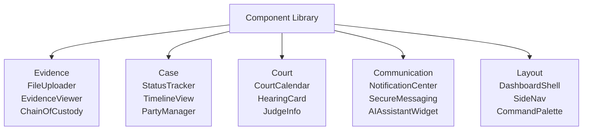

# Justice Tech Component Library

**Reusable building blocks for the ecosystem.**

## The Problem

Every justice tech organization rebuilds the same components from scratch -- file uploaders, case trackers, calendars, notification systems -- wasting precious time and funding. The result is fragmented, inconsistent tools that don't interoperate and can't be maintained long-term.

## The Solution

An open-source, accessible, well-tested component library purpose-built for justice applications. This directly answers the call to "create shared, open-source component libraries" for the justice tech ecosystem. Instead of every organization reinventing the wheel, teams can build on a common foundation and focus their energy on what makes their tool unique.



## Who This Helps

- **Justice tech developers** who want production-ready, accessible components out of the box
- **Legal aid organizations** building tools on tight budgets and timelines
- **Court IT departments** modernizing legacy systems with consistent UI patterns
- **Civic tech volunteers** contributing to justice projects without starting from zero

## Features

- **20+ production-ready components** spanning evidence, case, court, communication, and layout
- **WCAG 2.1 AA accessible** -- every component meets accessibility standards
- **Storybook documentation** -- interactive examples and usage guides for every component
- **TypeScript-first** -- full type safety and IntelliSense support
- **Tailwind CSS styling** -- customizable design tokens that adapt to any brand
- **Tree-shakeable ESM exports** -- import only what you need, keep bundles small

## Getting Started

```bash
npm install @justice-os/components
```

```tsx
import { FileUploader, StatusTracker, DashboardShell } from '@justice-os/components';
```

### Development

```bash
git clone https://github.com/dougdevitre/justice-components.git
cd justice-components
npm install
npm run dev  # Opens Storybook at localhost:6006
```

## Contributing

See [CONTRIBUTING.md](./CONTRIBUTING.md) for guidelines.

## License

MIT -- see [LICENSE](./LICENSE) for details.
