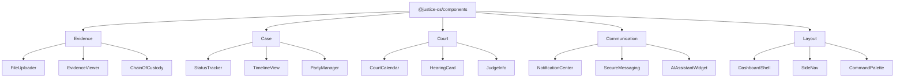
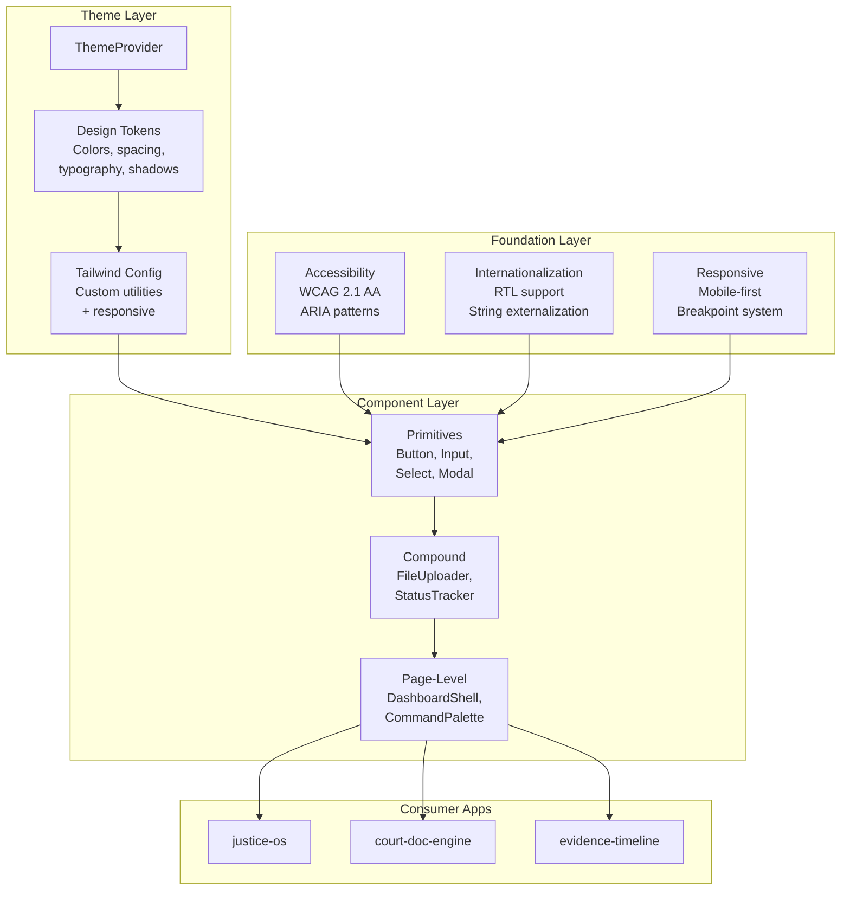
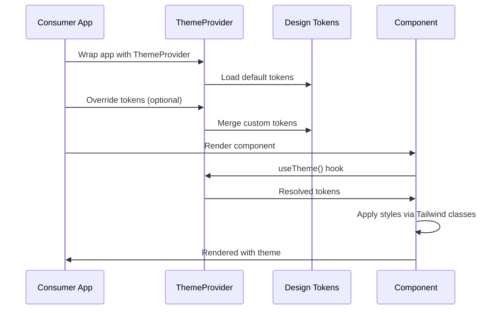
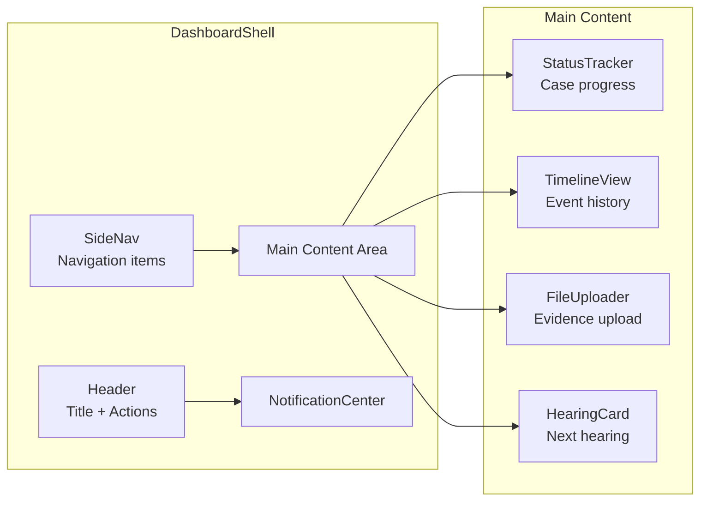
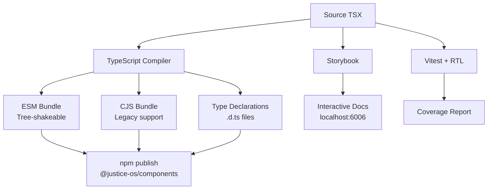

# Justice Tech Component Library -- Architecture

## Component Taxonomy

```mermaid
graph TD
    A["@justice-os/components"] --> B[Evidence]
    A --> C[Case]
    A --> D[Court]
    A --> E[Communication]
    A --> F[Layout]

    B --> B1[FileUploader]
    B --> B2[EvidenceViewer]
    B --> B3[ChainOfCustody]

    C --> C1[StatusTracker]
    C --> C2[TimelineView]
    C --> C3[PartyManager]

    D --> D1[CourtCalendar]
    D --> D2[HearingCard]
    D --> D3[JudgeInfo]

    E --> E1[NotificationCenter]
    E --> E2[SecureMessaging]
    E --> E3[AIAssistantWidget]

    F --> F1[DashboardShell]
    F --> F2[SideNav]
    F --> F3[CommandPalette]
```

## Design System Architecture

```mermaid
graph TB
    subgraph "Theme Layer"
        TP[ThemeProvider]
        DT[Design Tokens<br/>Colors, spacing,<br/>typography, shadows]
        TW[Tailwind Config<br/>Custom utilities<br/>+ responsive]
    end

    subgraph "Foundation Layer"
        A11Y[Accessibility<br/>WCAG 2.1 AA<br/>ARIA patterns]
        I18N[Internationalization<br/>RTL support<br/>String externalization]
        RSP[Responsive<br/>Mobile-first<br/>Breakpoint system]
    end

    subgraph "Component Layer"
        PRM[Primitives<br/>Button, Input,<br/>Select, Modal]
        CMP[Compound<br/>FileUploader,<br/>StatusTracker]
        PAG[Page-Level<br/>DashboardShell,<br/>CommandPalette]
    end

    subgraph "Consumer Apps"
        APP1[justice-os]
        APP2[court-doc-engine]
        APP3[evidence-timeline]
    end

    TP --> DT
    DT --> TW
    TW --> PRM
    A11Y --> PRM
    I18N --> PRM
    RSP --> PRM
    PRM --> CMP
    CMP --> PAG
    PAG --> APP1
    PAG --> APP2
    PAG --> APP3
```

## Theme Provider Flow

```mermaid
sequenceDiagram
    participant App as Consumer App
    participant TP as ThemeProvider
    participant DT as Design Tokens
    participant Comp as Component

    App->>TP: Wrap app with ThemeProvider
    TP->>DT: Load default tokens
    App->>TP: Override tokens (optional)
    TP->>DT: Merge custom tokens

    App->>Comp: Render component
    Comp->>TP: useTheme() hook
    TP->>Comp: Resolved tokens
    Comp->>Comp: Apply styles via Tailwind classes
    Comp->>App: Rendered with theme
```

## Component Data Flow

```mermaid
graph LR
    subgraph "DashboardShell"
        Header[Header<br/>Title + Actions]
        SideNav[SideNav<br/>Navigation items]
        Main[Main Content Area]
        Notify[NotificationCenter]
    end

    subgraph "Main Content"
        ST[StatusTracker<br/>Case progress]
        TV[TimelineView<br/>Event history]
        FU[FileUploader<br/>Evidence upload]
        HC[HearingCard<br/>Next hearing]
    end

    Header --> Notify
    SideNav --> Main
    Main --> ST
    Main --> TV
    Main --> FU
    Main --> HC
```

## Build and Distribution

```mermaid
flowchart TD
    SRC[Source TSX] --> TSC[TypeScript Compiler]
    TSC --> ESM[ESM Bundle<br/>Tree-shakeable]
    TSC --> CJS[CJS Bundle<br/>Legacy support]
    TSC --> DTS[Type Declarations<br/>.d.ts files]

    SRC --> SB[Storybook]
    SB --> DOCS[Interactive Docs<br/>localhost:6006]

    ESM --> NPM["npm publish<br/>@justice-os/components"]
    CJS --> NPM
    DTS --> NPM

    SRC --> TEST[Vitest + RTL]
    TEST --> COV[Coverage Report]
```
